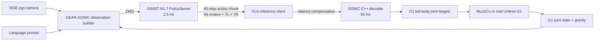

# Unitree G1 × NVIDIA Isaac GR00T N1.6/N1.7

Project end-to-end để chạy một policy vision-language-action generalist trên Unitree G1 bằng stack chính thức:

- NVIDIA Isaac GR00T N1.7 làm VLA policy;
- embodiment `UNITREE_G1_SONIC`;
- GEAR-SONIC giải mã latent action thành whole-body control;
- LeRobot v2.1 cho thu thập dữ liệu, fine-tune và evaluation;
- MuJoCo trước, robot thật sau;
- smoke backend chạy CPU để kiểm tra ngay toàn bộ orchestration, safety, rollout và report.

> Quan trọng: smoke backend không giả danh model GR00T. Nó phát action chunk đúng kích thước SONIC để test harness. Robot thật cần checkpoint `UNITREE_G1_SONIC` đã fine-tune từ dữ liệu G1 của chính task/scene cần chạy. Base model `nvidia/GR00T-N1.7-3B` không thể được dùng trực tiếp với post-training embodiment này.

## Trạng thái

| Phần | Có trong project | Cách chạy |
|---|---:|---|
| Multi-task CPU smoke demo | Có | `make demo` |
| Action contract 40 × (64 + 7 + 7) | Có | test + smoke runtime |
| Safety envelope và E-stop test | Có | `pytest` |
| HTML/JSON/JSONL evaluation report | Có | `artifacts/mock_demo/` |
| Upstream bootstrap có pin commit | Có | `scripts/bootstrap_upstreams.sh` |
| G1 data collection | Có | `gr00t-g1 collect` |
| Dataset cleaning/validation | Có | `process-dataset`, `dataset-check` |
| GR00T fine-tune | Có | `gr00t-g1 train` |
| Open-loop evaluation | Có | `gr00t-g1 open-loop` |
| PolicyServer | Có | `gr00t-g1 serve` |
| SONIC + MuJoCo rollout | Có | `gr00t-g1 deploy --mode sim` |
| Isaac Sim + GR00T static rollout | Có, đã chạy thật | `scripts/run_arena_static_apple.sh start` |
| Isaac Sim + GR00T loco-manipulation | Có, đã chạy thật | `scripts/run_arena_loco_box.sh start` |
| A0: GR00T-N1.7-LIBERO original | Có | `gr00t-g1 a0-check` |
| A1: shared GR00T-RC post-training | Có | `gr00t-g1 a1-check` |
| A2: GR00T-RC + fixed hierarchy | Có | `gr00t-g1 a2-check` |
| B: GR00T-RC + SparkVLA-style execution | Có | `gr00t-g1 b-check` |
| G1 real deployment interlock | Có | `gr00t-g1 deploy --mode real` |

## Ba demo Isaac Sim đã chạy thật

Các launcher headless vẫn render và ghi MP4, nhưng chạy tách khỏi VS Code để tránh
xung đột GPU/Vulkan trên máy một GPU.

| Lệnh | Kết quả |
|---|---:|
| Apple → đĩa, GR00T N1.7 | 2/3 episode thành công (66.7%) |
| Hộp nâu → thùng xanh, GR00T N1.6 | 1/1 episode thành công (100%) |
| Banana → đĩa bằng checkpoint apple, OOD | 0/2 thành công; vật thể vẫn di chuyển 2/2 |

Lệnh chạy lại, vị trí video/report và giải thích giới hạn zero-shot nằm tại
[docs/ISAAC_ARENA_DEMOS.md](docs/ISAAC_ARENA_DEMOS.md).

## Kiến trúc



GR00T quyết định “làm gì”; SONIC đảm nhiệm locomotion, balance và coordinated whole-body motion. Chi tiết interface nằm ở [docs/ARCHITECTURE.md](docs/ARCHITECTURE.md).

## Chạy ngay trên CPU

Không cần CUDA, model weights hay robot:

```bash
make setup
.venv/bin/gr00t-g1 doctor --profile mock
.venv/bin/gr00t-g1 demo --episodes 3
```

Hoặc không tạo virtualenv:

```bash
PYTHONPATH=src python3 -m unitree_gr00t.cli demo --episodes 3
```

Hoặc chạy isolated CPU container:

```bash
docker compose run --rm cpu-smoke
```

Demo chạy năm instruction thuộc ba họ task `pick`, `place`, `stack` trên nhiều scene random. Output:

```text
artifacts/mock_demo/
├── report.html
├── summary.json
└── episodes.jsonl
```

Chạy subset task:

```bash
gr00t-g1 demo --tasks pick_red_cube,stack_red_on_blue --episodes 10 --seed 42
```

## Cài stack GPU/robot

Yêu cầu chính:

- Linux x86_64 hoặc platform NVIDIA được upstream hỗ trợ;
- GPU NVIDIA tối thiểu 16 GB VRAM cho inference N1.7;
- Python 3.12/CUDA environment riêng cho Isaac-GR00T;
- Python 3.10 environments riêng của GEAR-SONIC;
- `git`, `git-lfs`, `uv`, FFmpeg 4–7, `tmux`, `just`, compiler toolchain;
- quyền truy cập gated model `nvidia/Cosmos-Reason2-2B` trên Hugging Face.

Clone đúng hai upstream và pin revision đã kiểm thử:

```bash
scripts/bootstrap_upstreams.sh
```

Clone và cài các Python environments (tốn thời gian/dung lượng):

```bash
scripts/bootstrap_upstreams.sh --install
```

Build controller và tải SONIC v1.1:

```bash
cd .upstream/GR00T-WholeBodyControl/gear_sonic_deploy
just build
cd ../../..

hf auth login
scripts/download_models.sh
```

Kiểm tra simulation profile:

```bash
gr00t-g1 doctor --profile sim --online
```

## Workflow generalist hoàn chỉnh

### 1. Thu demonstration

Test teleoperation và camera trong MuJoCo trước:

```bash
gr00t-g1 collect \
  --mode sim \
  --prompt "pick up the soda can and place it in the bin" \
  --dataset-name soda_can_to_bin \
  --execute
```

Khi sim ổn định, dùng cùng prompt trên robot thật. Real mode bị khóa bằng safety acknowledgement; xem [docs/SAFETY.md](docs/SAFETY.md) trước khi mở khóa.

### 2. Làm sạch và validate dataset

```bash
gr00t-g1 process-dataset \
  --dataset .upstream/GR00T-WholeBodyControl/outputs/soda_can_to_bin \
  --output outputs/soda_can_to_bin_clean \
  --execute

gr00t-g1 dataset-check outputs/soda_can_to_bin_clean
```

Validator kiểm tra LeRobot layout, task/episode metadata, ego video và các modality bắt buộc của SONIC.

### 3. Fine-tune GR00T N1.7

Mặc định command chỉ preview để có thể review trước khi dùng GPU:

```bash
gr00t-g1 train \
  --dataset outputs/soda_can_to_bin_clean \
  --output checkpoints/g1_sonic_soda \
  --num-gpus 4
```

Thêm `--execute` sau khi command và dataset đã đúng. Xem [docs/DATA_AND_TRAINING.md](docs/DATA_AND_TRAINING.md) để thiết kế dataset multi-task thực sự general thay vì overfit một prompt.

### 4. Start PolicyServer

```bash
gr00t-g1 serve \
  --checkpoint checkpoints/g1_sonic_soda/checkpoint-20000 \
  --execute
```

PolicyServer chạy ở `127.0.0.1:5550` theo mặc định. Đổi host/port trong `configs/project.toml` nếu inference client ở máy khác.

### 5. Open-loop evaluation

Mở terminal khác trong khi server đang chạy:

```bash
gr00t-g1 open-loop \
  --dataset outputs/soda_can_to_bin_clean \
  --traj-ids 0,1,2,3,4 \
  --execution-horizon 8 \
  --execute
```

Chỉ chuyển sang closed-loop sau khi predicted action có scale/shape hợp lý và bám ground truth.

### 6. Closed-loop MuJoCo

```bash
gr00t-g1 deploy \
  --mode sim \
  --prompt "pick up the soda can and place it in the bin" \
  --execute
```

Launcher mở tmux gồm PolicyClient, SONIC C++ controller, MuJoCo, keyboard và recorder. Xem [docs/DEPLOYMENT.md](docs/DEPLOYMENT.md).

### 7. Unitree G1 thật

Sau khi sim pass, camera/network pass và có safety operator:

```bash
gr00t-g1 doctor --profile real --online

gr00t-g1 deploy \
  --mode real \
  --prompt "pick up the soda can and place it in the bin" \
  --execute \
  --acknowledge-real-robot-risk I_UNDERSTAND_G1_CAN_MOVE
```

Emergency stop của C++ controller là phím `O`; hardware E-stop vẫn là lớp bảo vệ bắt buộc.

## Cấu trúc repository

```text
configs/                  Project, upstream, model, task và safety config
docs/                     Architecture, data/training, deployment, safety
scripts/                  Pinned bootstrap và model download
src/unitree_gr00t/        CLI, simulator, policy contract, validator, reports
tests/                    CPU-safe unit + end-to-end tests
.github/workflows/ci.yml  Lint, test và smoke demo
docker/                   CPU smoke image; GPU/Jetson dùng Docker upstream
```

## Kiểm thử

```bash
make test
make lint
gr00t-g1 demo --episodes 10 --seed 42
```

CPU tests không tải model và không gửi command tới robot. Các command GPU/robot chỉ preview nếu thiếu `--execute`.
`make test` cũng tắt auto-loading pytest plugin từ ROS/system Python để test environment được cô lập.

## Upstream chuẩn

- [NVIDIA/Isaac-GR00T](https://github.com/NVIDIA/Isaac-GR00T)
- [NVlabs/GR00T-WholeBodyControl](https://github.com/NVlabs/GR00T-WholeBodyControl)
- [GR00T Policy API](https://github.com/NVIDIA/Isaac-GR00T/blob/main/getting_started/policy.md)
- [GEAR-SONIC VLA workflow](https://nvlabs.github.io/GR00T-WholeBodyControl/tutorials/vla_workflow.html)
- [GEAR-SONIC VLA inference](https://nvlabs.github.io/GR00T-WholeBodyControl/tutorials/vla_inference.html)

Project code dùng Apache-2.0. Model weights và robot assets tuân theo license riêng của từng upstream/Hugging Face repository.

## Experiment A0: GR00T-N1.7-LIBERO original

A0 chạy nguyên checkpoint NVIDIA `nvidia/GR00T-N1.7-LIBERO/libero_10` trên
RoboCerebra. Policy luôn nhận full-task instruction; A0 không có hierarchical
planner, stop/adaptive selector, retry hoặc recovery. Contract `libero_sim` thật
của checkpoint xuất 16 action mỗi lần infer, vì vậy `H16` là cấu hình native;
`H8` chỉ là fixed receding-horizon control.

Kiểm tra checkpoint, model shards và benchmark cases:

```bash
PYTHONPATH=src python3 -m unitree_gr00t.cli a0-check \
  --task-types Ideal \
  --cases case1
```

Cài môi trường MuJoCo/LIBERO riêng cho evaluator:

```bash
scripts/setup_robocerebra_a0.sh
```

Chạy server trong terminal thứ nhất:

```bash
PYTHONPATH=src python3 -m unitree_gr00t.cli a0-server --seed 7 --execute
```

Chạy deterministic pilot trong terminal thứ hai:

```bash
PYTHONPATH=src python3 -m unitree_gr00t.cli a0-eval \
  --task-types Ideal \
  --cases case1 \
  --trials 1 \
  --execution-horizon 16 \
  --seed 7 \
  --output artifacts/A0/pilot-ideal-case1-h16-seed7 \
  --execute
```

Mỗi policy decision ghi full predicted chunk, fixed prefix đã thực thi, subtask
progress, provenance, trạng thái simulator sau từng action và đường dẫn đến đúng
RGB/proprioception tensor đã đưa vào model. Evaluator chạy trên timeline liên tục,
không restore state trong rollout; hai condition động dùng injection có seed, còn
observation mismatch dùng shifted initial state chính thức. Kết quả episode phân
biệt `reached_success` với `final_success` sau cửa sổ hậu thành công để phát hiện
policy tự phá kết quả. Một output directory đã có trace sẽ không được tái sử dụng,
tránh trộn hai run.

Chạy artifact đầy đủ (60 task × 10 rollout cho cả H16 và H8):

```bash
scripts/run_a0_full_benchmark.sh
```

Runner giữ lại episode hoàn chỉnh khi tiếp tục sau gián đoạn, chạy các simulator
shard song song qua một policy server GPU, kiểm tra đủ đúng 600 episode cho mỗi
horizon rồi mới merge. Báo cáo reviewer được sinh tại
`artifacts/A0/full-benchmark/reviewer/`, gồm SR theo benchmark, terminal goal-state
SR với CI 95%, kết quả theo condition/task, action efficiency, stability,
inference latency, robustness delta, H8/H16 ablation, environment/provenance và
SHA-256 của các file artifact chính. A0 không có high-level planner hoặc VideoQA,
vì vậy Plan Match, symbolic Plan Efficiency và VideoQA completion được ghi `N/A`
thay vì suy diễn một con số không tồn tại.

## Experiment A1: shared GR00T-RC post-training

A1 bắt đầu từ đúng checkpoint A0, post-train một checkpoint chung trên snapshot
`qiukingballball/RoboCerebra` đã pin, rồi dùng lại evaluator liên tục H16/H8 của
A0. A1 vẫn chỉ nhận full-task instruction và không có hierarchy, stop selector,
retry hoặc recovery. Đây là baseline đo riêng tác động của post-training.

Tải phần dữ liệu tối thiểu cần cho state replay (không tải bản RLDS/MP4 trùng lặp),
audit nguồn và convert sang LeRobot v2.1:

```bash
scripts/download_a1_training_data.sh
A1_CONVERSION_WORKERS=10 scripts/run_a1_prepare_dataset.sh
```

Snapshot có 1.000 manifest row; contract đã pin chấp nhận đúng 995 episode có thể
replay. Bốn row thiếu `demo.hdf5` và một row thiếu BDDL authoritative bị loại và
được ghi tên trong `meta/a1_source_audit.json`. Khi một thư mục có BDDL dư, converter
chọn chính xác basename được lưu trong metadata HDF5. Instruction dùng cho train
cũng lấy từ `problem_info.language_instruction` của HDF5, không dùng summary lệch.
Converter đồng thời bật MuJoCo compiler `autolimits` trên XML sinh ra để các asset
LIBERO cũ có ranged joint (đặc biệt `window`) chạy được trên MuJoCo 2.3.7.

Chạy post-training dài, có thể resume từ checkpoint mỗi 1.000 optimizer step:

```bash
PYTHONPATH="$PWD/src" .venv/bin/python -m unitree_gr00t.cli a1-train --execute
```

Profile một GPU 16 GiB giữ nguyên projector + diffusion action model trainable,
đóng băng language/visual backbone, dùng BF16, gradient checkpointing, Adafactor,
micro-batch 2 × gradient accumulation 16, tám data-loader worker và 20.000 step.
Các lựa chọn khác với launcher NVIDIA mặc định được ghi trong training manifest.

Sau khi checkpoint hoàn tất, chạy full benchmark A1 và sinh reviewer artifact:

```bash
scripts/run_a1_full_benchmark.sh
```

Output lớn (checkpoint, raw decisions, frame trace và shard) được giữ local. Bundle
reviewer-safe được force-add lên nhánh A1 gồm manifest, summary, CSV/JSON report,
chart, environment, inventory và SHA-256 của artifact raw để GitHub không nhận file
vượt giới hạn 100 MiB.

## Experiment A2: GR00T-RC + fixed hierarchy

A2 dùng nguyên checkpoint A1 đã freeze và chỉ thêm hierarchy cố định từ evaluator
công khai của RoboCerebra. Mỗi `task_description.txt` chuẩn cung cấp chuỗi `Step:`;
low-level GR00T-RC nhận đúng một step trong 150 control step rồi chuyển sang step kế
tiếp theo tại anchor đã định trước. Planner không đọc success predicate, không xem
ảnh, không re-plan, không retry, không restore simulator state và không chứa recovery.
Vì public evaluator không phát hành System-2/VLM runtime đầy đủ như mô tả trong paper,
implementation được ghi chính xác là `HPE-fixed-anchor-reimplementation`, không giả
danh HPE động chính thức.

Kiểm tra checkpoint dùng chung, toàn bộ 60 plan và 563 subgoal:

```bash
PYTHONPATH=src python3 -m unitree_gr00t.cli a2-check \
  --task-types Ideal Memory_Execution Memory_Exploration Mix \
  Observation_Mismatching Random_Disturbance
```

Chạy pilot với server A1 trong terminal thứ nhất:

```bash
PYTHONPATH=src python3 -m unitree_gr00t.cli a2-server --seed 7 --execute
```

```bash
PYTHONPATH=src python3 -m unitree_gr00t.cli a2-eval \
  --task-types Ideal --cases case1 --trials 1 \
  --execution-horizon 16 --seed 7 \
  --output artifacts/A2/pilot-ideal-case1-h16-seed7 --execute
```

Mỗi decision lưu full-task instruction, active subgoal, index và giới hạn anchor,
hash plan, predicted H16 chunk, fixed prefix đã thực thi và toàn bộ transition vật
lý. Nếu H8/H16 đi qua anchor 150 bước, prefix chỉ bị cắt đúng tại anchor; đây là lịch
cố định theo clock, không phải stop/adaptive selection theo observation hay outcome.

Chạy full benchmark 600 episode cho từng H16 và H8:

```bash
scripts/run_a2_full_benchmark.sh
```

Reviewer report ghép từng rollout A2 với A1 theo đúng task/case/trial và horizon,
nhờ đó delta chính là tác động của fixed hierarchy trên checkpoint dùng chung;
report vẫn ghi riêng cảnh báo rằng diffusion-noise stream không được pair khi các
simulator worker gọi chung một policy server.

## Experiment B: GR00T-RC + SparkVLA-style execution

B giữ nguyên checkpoint A1 và chuỗi subgoal canonical của A2, nhưng thay anchor
150 bước bằng một selector học chung trên tập candidate
`[STOP, prefix-1, ..., prefix-16]`. STOP phải xuất hiện ở hai decision liên tiếp
mới chuyển subgoal; H8 chỉ mask prefix 9–16, nên H8/H16 dùng cùng trọng số selector.
Selector không nhận goal predicate, injection label, retry hay recovery signal lúc
evaluation. Đây là bản chuyển thể/reimplementation cho GR00T-RC từ
[SparkVLA arXiv:2608.16172v1](https://arxiv.org/abs/2608.16172v1), không phải code
hay checkpoint SparkVLA chính thức.

Các gate nhỏ B0–B10, sai khác kiến trúc và contract nhãn/loss được freeze tại
[docs/SPARKVLA_B_IMPLEMENTATION_PLAN.md](docs/SPARKVLA_B_IMPLEMENTATION_PLAN.md).
Index offline hiện có 967 demonstration hợp lệ, 28 annotation bị loại có audit,
203.410 sample và không trùng exact prompt với 60 case held-out. Vì nguồn public
không cung cấp goal-predicate contract đáng tin cậy cho rollout train thất bại, B
không tạo nhãn failure giả; limitation này được ghi trong manifest/checkpoint.

Chạy từng gate:

```bash
PYTHONPATH=src python3 -m unitree_gr00t.cli b-check --stage index
PYTHONPATH=src python3 -m unitree_gr00t.cli b-features --batch-size 64 --execute
PYTHONPATH=src python3 -m unitree_gr00t.cli b-check --stage features
PYTHONPATH=src python3 -m unitree_gr00t.cli b-train --execute
PYTHONPATH=src python3 -m unitree_gr00t.cli b-check --stage checkpoint
```

Pilot dùng `b-server` và `b-eval` giống cách A2 tách server/client. Pipeline đầy đủ
có resume từ feature episode và benchmark shard:

```bash
scripts/run_b_pipeline.sh
```

Mỗi decision B lưu toàn bộ 17 score, validity mask, candidate, context hash,
STOP streak/commit, predicted H16 chunk, prefix thật sự thực thi và transition vật
lý. Reviewer report so khớp B với A2 theo task/case/trial/horizon để cô lập tác động
của learned execution selector.
