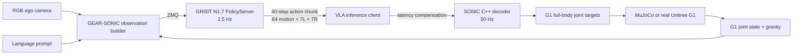

# Unitree G1 × NVIDIA Isaac GR00T N1.6/N1.7

Project end-to-end để chạy một policy vision-language-action generalist trên Unitree G1 bằng stack chính thức:

- NVIDIA Isaac GR00T N1.7 làm VLA policy;
- embodiment `UNITREE_G1_SONIC`;
- GEAR-SONIC giải mã latent action thành whole-body control;
- LeRobot v2.1 cho thu thập dữ liệu, fine-tune và evaluation;
- MuJoCo trước, robot thật sau;
- smoke backend chạy CPU để kiểm tra ngay toàn bộ orchestration, safety, rollout và report.

> Quan trọng: smoke backend không giả danh model GR00T. Nó phát action chunk đúng kích thước SONIC để test harness. Robot thật cần checkpoint `UNITREE_G1_SONIC` đã fine-tune từ dữ liệu G1 của chính task/scene cần chạy. Base model `nvidia/GR00T-N1.7-3B` không thể được dùng trực tiếp với post-training embodiment này.

## Trạng thái

| Phần | Có trong project | Cách chạy |
|---|---:|---|
| Multi-task CPU smoke demo | Có | `make demo` |
| Action contract 40 × (64 + 7 + 7) | Có | test + smoke runtime |
| Safety envelope và E-stop test | Có | `pytest` |
| HTML/JSON/JSONL evaluation report | Có | `artifacts/mock_demo/` |
| Upstream bootstrap có pin commit | Có | `scripts/bootstrap_upstreams.sh` |
| G1 data collection | Có | `gr00t-g1 collect` |
| Dataset cleaning/validation | Có | `process-dataset`, `dataset-check` |
| GR00T fine-tune | Có | `gr00t-g1 train` |
| Open-loop evaluation | Có | `gr00t-g1 open-loop` |
| PolicyServer | Có | `gr00t-g1 serve` |
| SONIC + MuJoCo rollout | Có | `gr00t-g1 deploy --mode sim` |
| Isaac Sim + GR00T static rollout | Có, đã chạy thật | `scripts/run_arena_static_apple.sh start` |
| Isaac Sim + GR00T loco-manipulation | Có, đã chạy thật | `scripts/run_arena_loco_box.sh start` |
| G1 real deployment interlock | Có | `gr00t-g1 deploy --mode real` |

## Ba demo Isaac Sim đã chạy thật

Các launcher headless vẫn render và ghi MP4, nhưng chạy tách khỏi VS Code để tránh
xung đột GPU/Vulkan trên máy một GPU.

| Lệnh | Kết quả |
|---|---:|
| Apple → đĩa, GR00T N1.7 | 2/3 episode thành công (66.7%) |
| Hộp nâu → thùng xanh, GR00T N1.6 | 1/1 episode thành công (100%) |
| Banana → đĩa bằng checkpoint apple, OOD | 0/2 thành công; vật thể vẫn di chuyển 2/2 |

Lệnh chạy lại, vị trí video/report và giải thích giới hạn zero-shot nằm tại
[docs/ISAAC_ARENA_DEMOS.md](docs/ISAAC_ARENA_DEMOS.md).

## Kiến trúc



GR00T quyết định “làm gì”; SONIC đảm nhiệm locomotion, balance và coordinated whole-body motion. Chi tiết interface nằm ở [docs/ARCHITECTURE.md](docs/ARCHITECTURE.md).

## Chạy ngay trên CPU

Không cần CUDA, model weights hay robot:

```bash
make setup
.venv/bin/gr00t-g1 doctor --profile mock
.venv/bin/gr00t-g1 demo --episodes 3
```

Hoặc không tạo virtualenv:

```bash
PYTHONPATH=src python3 -m unitree_gr00t.cli demo --episodes 3
```

Hoặc chạy isolated CPU container:

```bash
docker compose run --rm cpu-smoke
```

Demo chạy năm instruction thuộc ba họ task `pick`, `place`, `stack` trên nhiều scene random. Output:

```text
artifacts/mock_demo/
├── report.html
├── summary.json
└── episodes.jsonl
```

Chạy subset task:

```bash
gr00t-g1 demo --tasks pick_red_cube,stack_red_on_blue --episodes 10 --seed 42
```

## Cài stack GPU/robot

Yêu cầu chính:

- Linux x86_64 hoặc platform NVIDIA được upstream hỗ trợ;
- GPU NVIDIA tối thiểu 16 GB VRAM cho inference N1.7;
- Python 3.12/CUDA environment riêng cho Isaac-GR00T;
- Python 3.10 environments riêng của GEAR-SONIC;
- `git`, `git-lfs`, `uv`, FFmpeg 4–7, `tmux`, `just`, compiler toolchain;
- quyền truy cập gated model `nvidia/Cosmos-Reason2-2B` trên Hugging Face.

Clone đúng hai upstream và pin revision đã kiểm thử:

```bash
scripts/bootstrap_upstreams.sh
```

Clone và cài các Python environments (tốn thời gian/dung lượng):

```bash
scripts/bootstrap_upstreams.sh --install
```

Build controller và tải SONIC v1.1:

```bash
cd .upstream/GR00T-WholeBodyControl/gear_sonic_deploy
just build
cd ../../..

hf auth login
scripts/download_models.sh
```

Kiểm tra simulation profile:

```bash
gr00t-g1 doctor --profile sim --online
```

## Workflow generalist hoàn chỉnh

### 1. Thu demonstration

Test teleoperation và camera trong MuJoCo trước:

```bash
gr00t-g1 collect \
  --mode sim \
  --prompt "pick up the soda can and place it in the bin" \
  --dataset-name soda_can_to_bin \
  --execute
```

Khi sim ổn định, dùng cùng prompt trên robot thật. Real mode bị khóa bằng safety acknowledgement; xem [docs/SAFETY.md](docs/SAFETY.md) trước khi mở khóa.

### 2. Làm sạch và validate dataset

```bash
gr00t-g1 process-dataset \
  --dataset .upstream/GR00T-WholeBodyControl/outputs/soda_can_to_bin \
  --output outputs/soda_can_to_bin_clean \
  --execute

gr00t-g1 dataset-check outputs/soda_can_to_bin_clean
```

Validator kiểm tra LeRobot layout, task/episode metadata, ego video và các modality bắt buộc của SONIC.

### 3. Fine-tune GR00T N1.7

Mặc định command chỉ preview để có thể review trước khi dùng GPU:

```bash
gr00t-g1 train \
  --dataset outputs/soda_can_to_bin_clean \
  --output checkpoints/g1_sonic_soda \
  --num-gpus 4
```

Thêm `--execute` sau khi command và dataset đã đúng. Xem [docs/DATA_AND_TRAINING.md](docs/DATA_AND_TRAINING.md) để thiết kế dataset multi-task thực sự general thay vì overfit một prompt.

### 4. Start PolicyServer

```bash
gr00t-g1 serve \
  --checkpoint checkpoints/g1_sonic_soda/checkpoint-20000 \
  --execute
```

PolicyServer chạy ở `127.0.0.1:5550` theo mặc định. Đổi host/port trong `configs/project.toml` nếu inference client ở máy khác.

### 5. Open-loop evaluation

Mở terminal khác trong khi server đang chạy:

```bash
gr00t-g1 open-loop \
  --dataset outputs/soda_can_to_bin_clean \
  --traj-ids 0,1,2,3,4 \
  --execution-horizon 8 \
  --execute
```

Chỉ chuyển sang closed-loop sau khi predicted action có scale/shape hợp lý và bám ground truth.

### 6. Closed-loop MuJoCo

```bash
gr00t-g1 deploy \
  --mode sim \
  --prompt "pick up the soda can and place it in the bin" \
  --execute
```

Launcher mở tmux gồm PolicyClient, SONIC C++ controller, MuJoCo, keyboard và recorder. Xem [docs/DEPLOYMENT.md](docs/DEPLOYMENT.md).

### 7. Unitree G1 thật

Sau khi sim pass, camera/network pass và có safety operator:

```bash
gr00t-g1 doctor --profile real --online

gr00t-g1 deploy \
  --mode real \
  --prompt "pick up the soda can and place it in the bin" \
  --execute \
  --acknowledge-real-robot-risk I_UNDERSTAND_G1_CAN_MOVE
```

Emergency stop của C++ controller là phím `O`; hardware E-stop vẫn là lớp bảo vệ bắt buộc.

## Cấu trúc repository

```text
configs/                  Project, upstream, model, task và safety config
docs/                     Architecture, data/training, deployment, safety
scripts/                  Pinned bootstrap và model download
src/unitree_gr00t/        CLI, simulator, policy contract, validator, reports
tests/                    CPU-safe unit + end-to-end tests
.github/workflows/ci.yml  Lint, test và smoke demo
docker/                   CPU smoke image; GPU/Jetson dùng Docker upstream
```

## Kiểm thử

```bash
make test
make lint
gr00t-g1 demo --episodes 10 --seed 42
```

CPU tests không tải model và không gửi command tới robot. Các command GPU/robot chỉ preview nếu thiếu `--execute`.
`make test` cũng tắt auto-loading pytest plugin từ ROS/system Python để test environment được cô lập.

## Upstream chuẩn

- [NVIDIA/Isaac-GR00T](https://github.com/NVIDIA/Isaac-GR00T)
- [NVlabs/GR00T-WholeBodyControl](https://github.com/NVlabs/GR00T-WholeBodyControl)
- [GR00T Policy API](https://github.com/NVIDIA/Isaac-GR00T/blob/main/getting_started/policy.md)
- [GEAR-SONIC VLA workflow](https://nvlabs.github.io/GR00T-WholeBodyControl/tutorials/vla_workflow.html)
- [GEAR-SONIC VLA inference](https://nvlabs.github.io/GR00T-WholeBodyControl/tutorials/vla_inference.html)

Project code dùng Apache-2.0. Model weights và robot assets tuân theo license riêng của từng upstream/Hugging Face repository.
