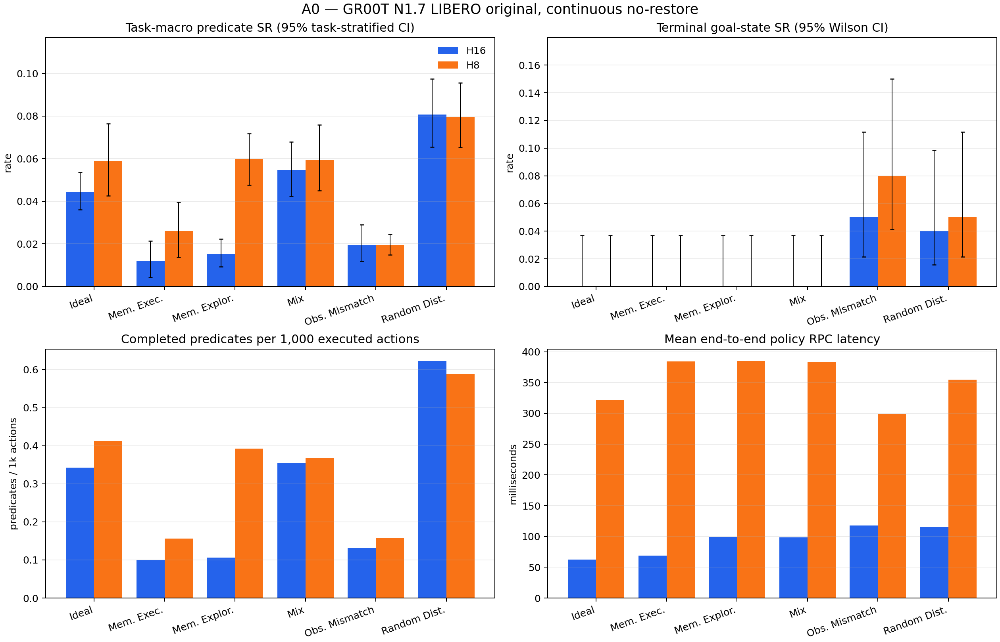

# A0 full RoboCerebra benchmark — reviewer report

## Scope and research question

A0 measures how far the unmodified `GR00T-N1.7-LIBERO/libero_10` low-level policy can execute a long-horizon full-task instruction without a hierarchy, stop/adaptive chunk selector, retry, or recovery. The benchmark covers static, memory, partial-observation, disturbance, and mixed conditions on one continuous simulator timeline.

The official [RoboCerebra paper](https://arxiv.org/html/2506.06677v2) defines 60 tasks and 10 rollouts per task, and reports predicate/subtask success as its SR. This report additionally retains terminal goal-state success, ordered-goal reach, confidence intervals, action efficiency, post-reach stability, latency, and per-episode artifacts. The statistical reporting follows the artifact-level caution recommended by the [2026 manipulation benchmark audit](https://arxiv.org/html/2606.04233).

## Benchmark coverage

| Condition | Capability stressed | A0 continuous-track realization |
| --- | --- | --- |
| Ideal | Static, fully observable long-horizon execution | Official Ideal task and initial state |
| Memory_Exploration | Active exploration to build an internal representation | Official exploration task, description, goals, scene, and initial state |
| Memory_Execution | Retrieval of previously relevant state for goal completion | Official memory-execution task, description, goals, scene, and initial state |
| Observation_Mismatching | Plan/perception misalignment | Official Ideal scene shifted to the second annotated demonstration state; already-forced predicates excluded |
| Random_Disturbance | Unexpected environment changes | Seeded 0.15 m object-y displacements during one uninterrupted rollout |
| Mix | Memory plus dynamic change and partial observation | Official Mix scene with shifted start and the same seeded displacement rule |

Each policy sees the unchanged full-task language instruction and live agent/wrist RGB plus proprioception. A0 supplies no subgoal, symbolic memory, failure detector, retry, or state restoration.

## Headline results

| Run | Episodes | Task-macro SR (paper Eq. 1) | Pooled predicate SR | Terminal goal-state SR | Mean steps | Calls | Mean policy RPC |
| --- | ---: | ---: | ---: | ---: | ---: | ---: | ---: |
| H16 | 600 | 3.77% [3.35%, 4.21%] | 4.06% [3.63%, 4.53%] | 1.50% [0.79%, 2.83%] | 1407.50 | 88.43 | 93.11 ms |
| H8 | 600 | 5.05% [4.51%, 5.61%] | 5.34% [4.80%, 5.88%] | 2.17% [1.27%, 3.67%] | 1407.50 | 176.33 | 360.29 ms |

## Published RoboCerebra context

These Table 3 averages use the paper's benchmark-compatible resume/anchor protocol and are context only; they are not directly rank-comparable with this report's continuous no-restore A0 track.

| Published system | Average SR |
| --- | ---: |
| OpenVLA-Libero100 | 2.00% |
| OpenVLA* | 4.57% |
| Planner + OpenVLA* | 16.04% |
| Hierarchical Framework (HPE) | 16.55% |

## Results by condition

### H16

| Condition | Task-macro SR | Pooled SR | Terminal-state SR | Ordered-goal reached SR | Steps | Injections |
| --- | ---: | ---: | ---: | ---: | ---: | ---: |
| Ideal | 4.44% [3.61%, 5.36%] | 5.13% [4.21%, 6.05%] | 0.00% [0.00%, 3.70%] | 0.00% [0.00%, 3.70%] | 1140.00 | 0 |
| Memory_Execution | 1.20% [0.43%, 2.13%] | 1.54% [0.58%, 2.69%] | 0.00% [0.00%, 3.70%] | 0.00% [0.00%, 3.70%] | 1605.00 | 0 |
| Memory_Exploration | 1.52% [0.93%, 2.23%] | 1.60% [1.01%, 2.27%] | 0.00% [0.00%, 3.70%] | 0.00% [0.00%, 3.70%] | 1785.00 | 0 |
| Mix | 5.47% [4.23%, 6.79%] | 6.04% [4.69%, 7.50%] | 0.00% [0.00%, 3.70%] | 0.00% [0.00%, 3.70%] | 1635.00 | 990 |
| Observation_Mismatching | 1.93% [1.19%, 2.89%] | 2.27% [1.67%, 3.03%] | 5.00% [2.15%, 11.18%] | 0.00% [0.00%, 3.70%] | 1140.00 | 0 |
| Random_Disturbance | 8.06% [6.54%, 9.74%] | 9.34% [7.76%, 10.92%] | 4.00% [1.57%, 9.84%] | 0.00% [0.00%, 3.70%] | 1140.00 | 660 |

### H8

| Condition | Task-macro SR | Pooled SR | Terminal-state SR | Ordered-goal reached SR | Steps | Injections |
| --- | ---: | ---: | ---: | ---: | ---: | ---: |
| Ideal | 5.87% [4.26%, 7.65%] | 6.18% [4.61%, 7.89%] | 0.00% [0.00%, 3.70%] | 0.00% [0.00%, 3.70%] | 1140.00 | 0 |
| Memory_Execution | 2.60% [1.37%, 3.95%] | 2.40% [1.25%, 3.65%] | 0.00% [0.00%, 3.70%] | 0.00% [0.00%, 3.70%] | 1605.00 | 0 |
| Memory_Exploration | 5.99% [4.75%, 7.18%] | 5.88% [4.71%, 7.06%] | 0.00% [0.00%, 3.70%] | 0.00% [0.00%, 3.70%] | 1785.00 | 0 |
| Mix | 5.95% [4.50%, 7.58%] | 6.25% [4.90%, 7.81%] | 0.00% [0.00%, 3.70%] | 0.00% [0.00%, 3.70%] | 1635.00 | 990 |
| Observation_Mismatching | 1.94% [1.49%, 2.46%] | 2.73% [2.12%, 3.33%] | 8.00% [4.11%, 15.00%] | 0.00% [0.00%, 3.70%] | 1140.00 | 0 |
| Random_Disturbance | 7.94% [6.53%, 9.56%] | 8.82% [7.37%, 10.39%] | 5.00% [2.15%, 11.18%] | 0.00% [0.00%, 3.70%] | 1140.00 | 660 |

## Fixed-horizon ablation

Delta convention: H16 minus H8.

- Paper SR delta: -1.28% [-1.97%, -0.59%]
- Pooled predicate SR delta: -1.28% [-1.99%, -0.60%]
- Terminal goal-state SR delta: -0.67% [-1.33%, 0.00%]
- Mean executed-step delta: 0.00 [0.00, 0.00]
- Partial-completion wins/ties/losses: {'wins': 60, 'ties': 454, 'losses': 86}

## Metric applicability

- RoboCerebra task-macro SR: the primary paper-style value, computed from Eq. (1) per task/rollout and averaged with equal weight across the 60 task instances.
- Reference-evaluator pooled SR: all completed state transitions divided by all possible transitions, matching the public evaluator's aggregate logger. It is reported separately because unequal task lengths make it differ from task-macro SR.
- Terminal goal-state SR (machine-readable legacy key `strict_full_task_success_rate`): every object's terminal goal predicate must hold in the final frame. It can be true even when the ordered evaluator never observed the full transition sequence.
- Ordered-goal reached SR: the public evaluator's sequential `_check_success` became true at least once. Stability/reactivation metrics are conditioned only on these reached episodes.
- Plan Match Accuracy and symbolic Plan Efficiency: N/A for A0 because it emits no symbolic high-level plan.
- VideoQA Action Completion Accuracy: N/A because A0 has no reflection/VideoQA head.
- Failure-detection precision/recall/latency and recovery success: N/A because A0 intentionally has neither detector nor recovery policy. Injection exposure and conditional outcomes remain in the raw episodes/traces.

## Reproducibility and limitations

Every run fixes model, dataset, and evaluator revisions; seed, task, trial, initial state, action conversion, 20 Hz control, full model input tensors, predicted chunks, executed transitions, and simulator state are retained. Policy/evaluator semantics and H8/H16 were frozen before inspecting full-test outcomes; only resumability, hardware sharding, integrity checks, and reporting were changed during execution. Confidence intervals quantify rollout uncertainty but do not establish real-world transfer. Simulator workers share one seeded stochastic policy server, so task/trial initial states are matched across horizons but policy diffusion noise is not paired under concurrent request interleaving. This continuous no-restore protocol is intentionally stricter than RoboCerebra's anchor/resume mechanism, so the paper table is contextual rather than a direct leaderboard comparison.

See `metrics.json`, the condition/case CSV files, `environment.json`, and `artifact_inventory.json` for machine-readable evidence. The environment file hashes the exact A0 implementation sources; the inventory hashes every core JSON/JSONL file and the complete frame tree.
