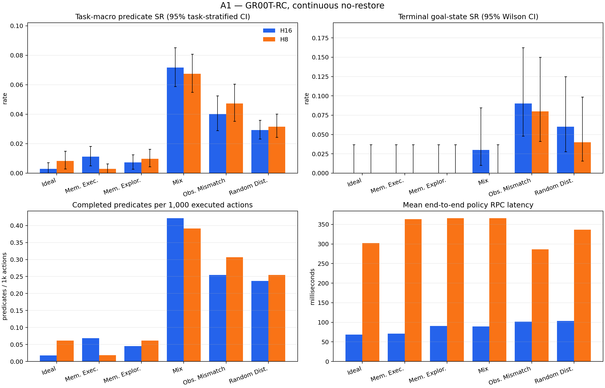

# A1 full RoboCerebra benchmark — reviewer report

## Scope and research question

A1 measures the shared post-trained `GR00T-RC` low-level policy's ability to execute a long-horizon full-task instruction without a hierarchy, stop/adaptive chunk selector, retry, or recovery. The benchmark covers static, memory, partial-observation, disturbance, and mixed conditions on one continuous simulator timeline.

The official [RoboCerebra paper](https://arxiv.org/html/2506.06677v2) defines 60 tasks and 10 rollouts per task, and reports predicate/subtask success as its SR. This report additionally retains terminal goal-state success, ordered-goal reach, confidence intervals, action efficiency, post-reach stability, latency, and per-episode artifacts. The statistical reporting follows the artifact-level caution recommended by the [2026 manipulation benchmark audit](https://arxiv.org/html/2606.04233).

## Benchmark coverage

| Condition | Capability stressed | A1 continuous-track realization |
| --- | --- | --- |
| Ideal | Static, fully observable long-horizon execution | Official Ideal task and initial state |
| Memory_Exploration | Active exploration to build an internal representation | Official exploration task, description, goals, scene, and initial state |
| Memory_Execution | Retrieval of previously relevant state for goal completion | Official memory-execution task, description, goals, scene, and initial state |
| Observation_Mismatching | Plan/perception misalignment | Official Ideal scene shifted to the second annotated demonstration state; already-forced predicates excluded |
| Random_Disturbance | Unexpected environment changes | Seeded 0.15 m object-y displacements during one uninterrupted rollout |
| Mix | Memory plus dynamic change and partial observation | Official Mix scene with shifted start and the same seeded displacement rule |

Each policy sees the unchanged full-task language instruction and live agent/wrist RGB plus proprioception. A1 supplies no subgoal, symbolic memory, failure detector, retry, or state restoration.

## Headline results

| Run | Episodes | Task-macro SR (paper Eq. 1) | Pooled predicate SR | Terminal goal-state SR | Mean steps | Calls | Mean policy RPC |
| --- | ---: | ---: | ---: | ---: | ---: | ---: | ---: |
| H16 | 600 | 2.71% [2.37%, 3.07%] | 2.72% [2.42%, 3.05%] | 3.00% [1.91%, 4.69%] | 1407.50 | 88.43 | 86.90 ms |
| H8 | 600 | 2.79% [2.43%, 3.16%] | 2.77% [2.46%, 3.09%] | 2.00% [1.15%, 3.46%] | 1407.50 | 176.33 | 342.14 ms |

## Published RoboCerebra context

These Table 3 averages use the paper's benchmark-compatible resume/anchor protocol and are context only; they are not directly rank-comparable with this report's continuous no-restore A1 track.

| Published system | Average SR |
| --- | ---: |
| OpenVLA-Libero100 | 2.00% |
| OpenVLA* | 4.57% |
| Planner + OpenVLA* | 16.04% |
| Hierarchical Framework (HPE) | 16.55% |

## Results by condition

### H16

| Condition | Task-macro SR | Pooled SR | Terminal-state SR | Ordered-goal reached SR | Steps | Injections |
| --- | ---: | ---: | ---: | ---: | ---: | ---: |
| Ideal | 0.29% [0.00%, 0.71%] | 0.26% [0.00%, 0.66%] | 0.00% [0.00%, 3.70%] | 0.00% [0.00%, 3.70%] | 1140.00 | 0 |
| Memory_Execution | 1.12% [0.51%, 1.81%] | 1.06% [0.48%, 1.73%] | 0.00% [0.00%, 3.70%] | 0.00% [0.00%, 3.70%] | 1605.00 | 0 |
| Memory_Exploration | 0.73% [0.28%, 1.25%] | 0.67% [0.25%, 1.18%] | 0.00% [0.00%, 3.70%] | 0.00% [0.00%, 3.70%] | 1785.00 | 0 |
| Mix | 7.18% [5.89%, 8.51%] | 7.19% [6.04%, 8.44%] | 3.00% [1.03%, 8.45%] | 0.00% [0.00%, 3.70%] | 1635.00 | 990 |
| Observation_Mismatching | 4.01% [2.89%, 5.24%] | 4.39% [3.33%, 5.45%] | 9.00% [4.81%, 16.23%] | 0.00% [0.00%, 3.70%] | 1140.00 | 0 |
| Random_Disturbance | 2.92% [2.32%, 3.58%] | 3.55% [3.03%, 4.08%] | 6.00% [2.78%, 12.48%] | 0.00% [0.00%, 3.70%] | 1140.00 | 660 |

### H8

| Condition | Task-macro SR | Pooled SR | Terminal-state SR | Ordered-goal reached SR | Steps | Injections |
| --- | ---: | ---: | ---: | ---: | ---: | ---: |
| Ideal | 0.83% [0.29%, 1.50%] | 0.92% [0.26%, 1.71%] | 0.00% [0.00%, 3.70%] | 0.00% [0.00%, 3.70%] | 1140.00 | 0 |
| Memory_Execution | 0.29% [0.00%, 0.63%] | 0.29% [0.00%, 0.58%] | 0.00% [0.00%, 3.70%] | 0.00% [0.00%, 3.70%] | 1605.00 | 0 |
| Memory_Exploration | 0.98% [0.43%, 1.62%] | 0.92% [0.42%, 1.51%] | 0.00% [0.00%, 3.70%] | 0.00% [0.00%, 3.70%] | 1785.00 | 0 |
| Mix | 6.74% [5.49%, 8.07%] | 6.67% [5.52%, 7.92%] | 0.00% [0.00%, 3.70%] | 0.00% [0.00%, 3.70%] | 1635.00 | 990 |
| Observation_Mismatching | 4.73% [3.53%, 6.04%] | 5.30% [4.24%, 6.36%] | 8.00% [4.11%, 15.00%] | 0.00% [0.00%, 3.70%] | 1140.00 | 0 |
| Random_Disturbance | 3.16% [2.44%, 4.01%] | 3.82% [3.16%, 4.61%] | 4.00% [1.57%, 9.84%] | 0.00% [0.00%, 3.70%] | 1140.00 | 660 |

## Fixed-horizon ablation

Delta convention: H16 minus H8.

- Paper SR delta: -0.08% [-0.51%, 0.34%]
- Pooled predicate SR delta: -0.06% [-0.43%, 0.32%]
- Terminal goal-state SR delta: 1.00% [0.17%, 1.83%]
- Mean executed-step delta: 0.00 [0.00, 0.00]
- Partial-completion wins/ties/losses: {'wins': 42, 'ties': 514, 'losses': 44}

## Metric applicability

- RoboCerebra task-macro SR: the primary paper-style value, computed from Eq. (1) per task/rollout and averaged with equal weight across the 60 task instances.
- Reference-evaluator pooled SR: all completed state transitions divided by all possible transitions, matching the public evaluator's aggregate logger. It is reported separately because unequal task lengths make it differ from task-macro SR.
- Terminal goal-state SR (machine-readable legacy key `strict_full_task_success_rate`): every object's terminal goal predicate must hold in the final frame. It can be true even when the ordered evaluator never observed the full transition sequence.
- Ordered-goal reached SR: the public evaluator's sequential `_check_success` became true at least once. Stability/reactivation metrics are conditioned only on these reached episodes.
- Plan Match Accuracy and symbolic Plan Efficiency: N/A for A1 because it emits no symbolic high-level plan.
- VideoQA Action Completion Accuracy: N/A because A1 has no reflection/VideoQA head.
- Failure-detection precision/recall/latency and recovery success: N/A because A1 intentionally has neither detector nor recovery policy. Injection exposure and conditional outcomes remain in the raw episodes/traces.

## Reproducibility and limitations

Every run fixes model, dataset, and evaluator revisions; seed, task, trial, initial state, action conversion, 20 Hz control, full model input tensors, predicted chunks, executed transitions, and simulator state are retained. Policy/evaluator semantics and H8/H16 were frozen before inspecting full-test outcomes; only resumability, hardware sharding, integrity checks, and reporting were changed during execution. Confidence intervals quantify rollout uncertainty but do not establish real-world transfer. Simulator workers share one seeded stochastic policy server, so task/trial initial states are matched across horizons but policy diffusion noise is not paired under concurrent request interleaving. This continuous no-restore protocol is intentionally stricter than RoboCerebra's anchor/resume mechanism, so the paper table is contextual rather than a direct leaderboard comparison.

See `metrics.json`, the condition/case CSV files, `environment.json`, and `artifact_inventory.json` for machine-readable evidence. The environment file hashes the exact A1 implementation sources; the inventory hashes every core JSON/JSONL file and the complete frame tree.
