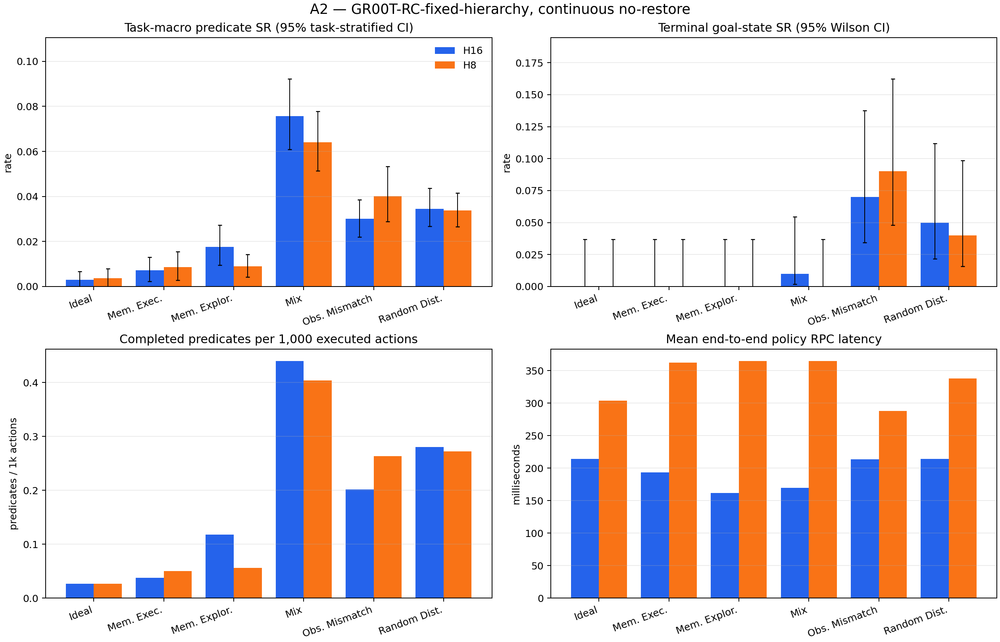

# A2 full RoboCerebra benchmark — reviewer report

## Scope and research question

A2 measures `GR00T-RC-fixed-hierarchy` with the frozen RoboCerebra fixed-anchor subgoal hierarchy with canonical step instructions switched at fixed 150-step anchors, but without outcome-aware switching, re-planning, stop/adaptive selection, retry, or recovery. The benchmark covers static, memory, partial-observation, disturbance, and mixed conditions on one continuous simulator timeline.

The official [RoboCerebra paper](https://arxiv.org/html/2506.06677v2) defines 60 tasks and 10 rollouts per task, and reports predicate/subtask success as its SR. This report additionally retains terminal goal-state success, ordered-goal reach, confidence intervals, action efficiency, post-reach stability, latency, and per-episode artifacts. The statistical reporting follows the artifact-level caution recommended by the [2026 manipulation benchmark audit](https://arxiv.org/html/2606.04233).

## Benchmark coverage

| Condition | Capability stressed | A2 continuous-track realization |
| --- | --- | --- |
| Ideal | Static, fully observable long-horizon execution | Official Ideal task and initial state |
| Memory_Exploration | Active exploration to build an internal representation | Official exploration task, description, goals, scene, and initial state |
| Memory_Execution | Retrieval of previously relevant state for goal completion | Official memory-execution task, description, goals, scene, and initial state |
| Observation_Mismatching | Plan/perception misalignment | Official Ideal scene shifted to the second annotated demonstration state; already-forced predicates excluded |
| Random_Disturbance | Unexpected environment changes | Seeded 0.15 m object-y displacements during one uninterrupted rollout |
| Mix | Memory plus dynamic change and partial observation | Official Mix scene with shifted start and the same seeded displacement rule |

The low-level policy sees the active canonical subgoal plus live agent/wrist RGB and proprioception. A2's planner is outcome-blind and supplies no symbolic memory, failure detector, retry, or state restoration.

## Headline results

| Run | Episodes | Task-macro SR (paper Eq. 1) | Pooled predicate SR | Terminal goal-state SR | Mean steps | Calls | Mean policy RPC |
| --- | ---: | ---: | ---: | ---: | ---: | ---: | ---: |
| H16 | 600 | 2.80% [2.43%, 3.18%] | 2.92% [2.55%, 3.30%] | 2.17% [1.27%, 3.67%] | 1407.50 | 93.83 | 190.37 ms |
| H8 | 600 | 2.65% [2.30%, 3.02%] | 2.76% [2.42%, 3.11%] | 2.17% [1.27%, 3.67%] | 1407.50 | 178.28 | 342.21 ms |

## Published RoboCerebra context

These Table 3 averages use the paper's benchmark-compatible resume/anchor protocol and are context only; they are not directly rank-comparable with this report's continuous no-restore A2 track.

| Published system | Average SR |
| --- | ---: |
| OpenVLA-Libero100 | 2.00% |
| OpenVLA* | 4.57% |
| Planner + OpenVLA* | 16.04% |
| Hierarchical Framework (HPE) | 16.55% |

## Results by condition

### H16

| Condition | Task-macro SR | Pooled SR | Terminal-state SR | Ordered-goal reached SR | Steps | Injections |
| --- | ---: | ---: | ---: | ---: | ---: | ---: |
| Ideal | 0.30% [0.00%, 0.66%] | 0.39% [0.00%, 0.79%] | 0.00% [0.00%, 3.70%] | 0.00% [0.00%, 3.70%] | 1140.00 | 0 |
| Memory_Execution | 0.72% [0.24%, 1.31%] | 0.58% [0.19%, 1.06%] | 0.00% [0.00%, 3.70%] | 0.00% [0.00%, 3.70%] | 1605.00 | 0 |
| Memory_Exploration | 1.76% [0.94%, 2.73%] | 1.76% [0.92%, 2.77%] | 0.00% [0.00%, 3.70%] | 0.00% [0.00%, 3.70%] | 1785.00 | 0 |
| Mix | 7.56% [6.08%, 9.22%] | 7.50% [6.25%, 8.96%] | 1.00% [0.18%, 5.45%] | 0.00% [0.00%, 3.70%] | 1635.00 | 990 |
| Observation_Mismatching | 3.01% [2.19%, 3.86%] | 3.48% [2.58%, 4.39%] | 7.00% [3.43%, 13.75%] | 0.00% [0.00%, 3.70%] | 1140.00 | 0 |
| Random_Disturbance | 3.45% [2.67%, 4.36%] | 4.21% [3.42%, 5.00%] | 5.00% [2.15%, 11.18%] | 0.00% [0.00%, 3.70%] | 1140.00 | 660 |

### H8

| Condition | Task-macro SR | Pooled SR | Terminal-state SR | Ordered-goal reached SR | Steps | Injections |
| --- | ---: | ---: | ---: | ---: | ---: | ---: |
| Ideal | 0.36% [0.00%, 0.79%] | 0.39% [0.00%, 0.92%] | 0.00% [0.00%, 3.70%] | 0.00% [0.00%, 3.70%] | 1140.00 | 0 |
| Memory_Execution | 0.86% [0.29%, 1.54%] | 0.77% [0.29%, 1.35%] | 0.00% [0.00%, 3.70%] | 0.00% [0.00%, 3.70%] | 1605.00 | 0 |
| Memory_Exploration | 0.90% [0.42%, 1.42%] | 0.84% [0.42%, 1.34%] | 0.00% [0.00%, 3.70%] | 0.00% [0.00%, 3.70%] | 1785.00 | 0 |
| Mix | 6.41% [5.13%, 7.77%] | 6.88% [5.52%, 8.33%] | 0.00% [0.00%, 3.70%] | 0.00% [0.00%, 3.70%] | 1635.00 | 990 |
| Observation_Mismatching | 4.01% [2.88%, 5.33%] | 4.55% [3.48%, 5.76%] | 9.00% [4.81%, 16.23%] | 0.00% [0.00%, 3.70%] | 1140.00 | 0 |
| Random_Disturbance | 3.37% [2.65%, 4.15%] | 4.08% [3.42%, 4.87%] | 4.00% [1.57%, 9.84%] | 0.00% [0.00%, 3.70%] | 1140.00 | 660 |

## Fixed-horizon ablation

Delta convention: H16 minus H8.

- Paper SR delta: 0.15% [-0.32%, 0.62%]
- Pooled predicate SR delta: 0.17% [-0.30%, 0.63%]
- Terminal goal-state SR delta: 0.00% [-0.83%, 0.83%]
- Mean executed-step delta: 0.00 [0.00, 0.00]
- Partial-completion wins/ties/losses: {'wins': 59, 'ties': 491, 'losses': 50}

## Paired fixed-hierarchy ablation against A1

A2 is paired against `A1` / `GR00T-RC` by identical task, case, trial, initial-state seed, and execution horizon. Policy diffusion noise is not paired because concurrent clients share one server RNG stream.

| Run | Paper SR delta | Pooled SR delta | Terminal SR delta | Step delta | Wins/ties/losses |
| --- | ---: | ---: | ---: | ---: | ---: |
| H16 | 0.09% [-0.37%, 0.55%] | 0.20% [-0.24%, 0.65%] | -0.83% [-1.83%, 0.00%] | 0.00 | {'wins': 55, 'ties': 496, 'losses': 49} |
| H8 | -0.13% [-0.57%, 0.30%] | -0.02% [-0.41%, 0.37%] | 0.17% [-0.50%, 0.83%] | 0.00 | {'wins': 45, 'ties': 510, 'losses': 45} |

## Metric applicability

- RoboCerebra task-macro SR: the primary paper-style value, computed from Eq. (1) per task/rollout and averaged with equal weight across the 60 task instances.
- Reference-evaluator pooled SR: all completed state transitions divided by all possible transitions, matching the public evaluator's aggregate logger. It is reported separately because unequal task lengths make it differ from task-macro SR.
- Terminal goal-state SR (machine-readable legacy key `strict_full_task_success_rate`): every object's terminal goal predicate must hold in the final frame. It can be true even when the ordered evaluator never observed the full transition sequence.
- Ordered-goal reached SR: the public evaluator's sequential `_check_success` became true at least once. Stability/reactivation metrics are conditioned only on these reached episodes.
- Plan Match Accuracy: 100% by construction because A2 consumes the benchmark's canonical annotated plan; this is a structural contract check, not a learned-planner result. Plan Efficiency is reported per run as paper SR divided by mean declared plan length.
- VideoQA Action Completion Accuracy: N/A because A2 has no reflection/VideoQA head.
- Failure-detection precision/recall/latency and recovery success: N/A because A2 intentionally has neither detector nor recovery policy. Injection exposure and conditional outcomes remain in the raw episodes/traces.

## Reproducibility and limitations

Every run fixes model, dataset, and evaluator revisions; seed, task, trial, initial state, action conversion, 20 Hz control, full model input tensors, predicted chunks, executed transitions, and simulator state are retained. Policy/evaluator semantics and H8/H16 were frozen before inspecting full-test outcomes; only resumability, hardware sharding, integrity checks, and reporting were changed during execution. Confidence intervals quantify rollout uncertainty but do not establish real-world transfer. Simulator workers share one seeded stochastic policy server, so task/trial initial states are matched across horizons but policy diffusion noise is not paired under concurrent request interleaving. This continuous no-restore protocol is intentionally stricter than RoboCerebra's anchor/resume mechanism, so the paper table is contextual rather than a direct leaderboard comparison.

See `metrics.json`, the condition/case CSV files, `environment.json`, and `artifact_inventory.json` for machine-readable evidence. The environment file hashes the exact A2 implementation sources; the inventory hashes every core JSON/JSONL file and the complete frame tree.
