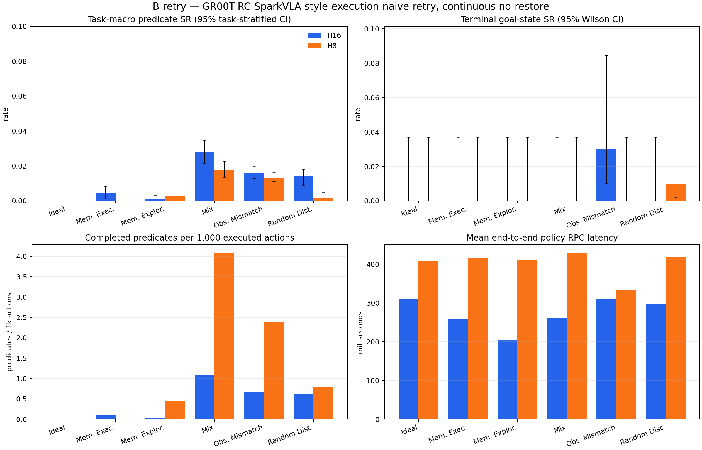

# B-retry full RoboCerebra benchmark — reviewer report

## Scope and research question

B-retry measures the frozen B policy with one fixed unconditional subtask retry with observation-conditioned prefix lengths and a fixed outcome-blind retry after the first confirmed STOP, but without failure detection, recovery memory, recovery policy, state restoration, or oracle signals. The benchmark covers static, memory, partial-observation, disturbance, and mixed conditions on one continuous simulator timeline.

The official [RoboCerebra paper](https://arxiv.org/html/2506.06677v2) defines 60 tasks and 10 rollouts per task, and reports predicate/subtask success as its SR. This report additionally retains terminal goal-state success, ordered-goal reach, confidence intervals, action efficiency, post-reach stability, latency, and per-episode artifacts. The statistical reporting follows the artifact-level caution recommended by the [2026 manipulation benchmark audit](https://arxiv.org/html/2606.04233).

The inherited B selector is a GR00T-RC adaptation of the unified STOP/action-prefix selector specified by [SparkVLA](https://arxiv.org/abs/2608.16172v1). The pinned SparkVLA repository supplied no code or checkpoint, and the local successful-demonstration corpus supplied no authoritative failed-rollout labels; results are therefore not presented as an official SparkVLA reproduction.

## Benchmark coverage

| Condition | Capability stressed | B-retry continuous-track realization |
| --- | --- | --- |
| Ideal | Static, fully observable long-horizon execution | Official Ideal task and initial state |
| Memory_Exploration | Active exploration to build an internal representation | Official exploration task, description, goals, scene, and initial state |
| Memory_Execution | Retrieval of previously relevant state for goal completion | Official memory-execution task, description, goals, scene, and initial state |
| Observation_Mismatching | Plan/perception misalignment | Official Ideal scene shifted to the second annotated demonstration state; already-forced predicates excluded |
| Random_Disturbance | Unexpected environment changes | Seeded 0.15 m object-y displacements during one uninterrupted rollout |
| Mix | Memory plus dynamic change and partial observation | Official Mix scene with shifted start and the same seeded displacement rule |

The low-level policy sees the active canonical subgoal plus live agent/wrist RGB and proprioception. B-retry's controller retries every subtask once without inspecting predicates or failures; it supplies no failure detector, recovery memory, recovery policy, or state restoration.

## Headline results

| Run | Episodes | Task-macro SR (paper Eq. 1) | Pooled predicate SR | Terminal goal-state SR | Mean steps | Calls | Mean policy RPC |
| --- | ---: | ---: | ---: | ---: | ---: | ---: | ---: |
| H16 | 600 | 1.07% [0.91%, 1.23%] | 1.25% [1.06%, 1.43%] | 0.50% [0.17%, 1.46%] | 331.96 | 59.23 | 264.83 ms |
| H8 | 600 | 0.58% [0.48%, 0.70%] | 0.67% [0.58%, 0.78%] | 0.17% [0.03%, 0.94%] | 43.61 | 43.67 | 404.61 ms |

## Naive retry exposure

| Run | Fixed retry attempts | Episodes with retry |
| --- | ---: | ---: |
| H16 | 5557 | 599 / 600 |
| H8 | 5630 | 600 / 600 |

## Published RoboCerebra context

These Table 3 averages use the paper's benchmark-compatible resume/anchor protocol and are context only; they are not directly rank-comparable with this report's continuous no-restore B-retry track.

| Published system | Average SR |
| --- | ---: |
| OpenVLA-Libero100 | 2.00% |
| OpenVLA* | 4.57% |
| Planner + OpenVLA* | 16.04% |
| Hierarchical Framework (HPE) | 16.55% |

## Results by condition

### H16

| Condition | Task-macro SR | Pooled SR | Terminal-state SR | Ordered-goal reached SR | Steps | Injections |
| --- | ---: | ---: | ---: | ---: | ---: | ---: |
| Ideal | 0.00% [0.00%, 0.00%] | 0.00% [0.00%, 0.00%] | 0.00% [0.00%, 3.70%] | 0.00% [0.00%, 3.70%] | 219.26 | 0 |
| Memory_Execution | 0.45% [0.11%, 0.85%] | 0.48% [0.10%, 0.87%] | 0.00% [0.00%, 3.70%] | 0.00% [0.00%, 3.70%] | 469.86 | 0 |
| Memory_Exploration | 0.10% [0.00%, 0.30%] | 0.08% [0.00%, 0.25%] | 0.00% [0.00%, 3.70%] | 0.00% [0.00%, 3.70%] | 539.37 | 0 |
| Mix | 2.82% [2.17%, 3.49%] | 3.12% [2.50%, 3.75%] | 0.00% [0.00%, 3.70%] | 0.00% [0.00%, 3.70%] | 277.91 | 146 |
| Observation_Mismatching | 1.59% [1.29%, 1.96%] | 2.27% [1.82%, 2.88%] | 3.00% [1.03%, 8.45%] | 0.00% [0.00%, 3.70%] | 222.83 | 0 |
| Random_Disturbance | 1.45% [0.91%, 1.82%] | 2.11% [1.32%, 2.63%] | 0.00% [0.00%, 3.70%] | 0.00% [0.00%, 3.70%] | 262.53 | 136 |

### H8

| Condition | Task-macro SR | Pooled SR | Terminal-state SR | Ordered-goal reached SR | Steps | Injections |
| --- | ---: | ---: | ---: | ---: | ---: | ---: |
| Ideal | 0.00% [0.00%, 0.00%] | 0.00% [0.00%, 0.00%] | 0.00% [0.00%, 3.70%] | 0.00% [0.00%, 3.70%] | 12.69 | 0 |
| Memory_Execution | 0.00% [0.00%, 0.00%] | 0.00% [0.00%, 0.00%] | 0.00% [0.00%, 3.70%] | 0.00% [0.00%, 3.70%] | 69.93 | 0 |
| Memory_Exploration | 0.25% [0.00%, 0.56%] | 0.25% [0.00%, 0.50%] | 0.00% [0.00%, 3.70%] | 0.00% [0.00%, 3.70%] | 66.85 | 0 |
| Mix | 1.77% [1.35%, 2.27%] | 2.08% [1.67%, 2.50%] | 0.00% [0.00%, 3.70%] | 0.00% [0.00%, 3.70%] | 48.97 | 8 |
| Observation_Mismatching | 1.31% [1.11%, 1.61%] | 1.82% [1.52%, 2.27%] | 0.00% [0.00%, 3.70%] | 0.00% [0.00%, 3.70%] | 50.54 | 0 |
| Random_Disturbance | 0.17% [0.00%, 0.50%] | 0.13% [0.00%, 0.39%] | 1.00% [0.18%, 5.45%] | 0.00% [0.00%, 3.70%] | 12.69 | 2 |

## Fixed-horizon ablation

Delta convention: H16 minus H8.

- Paper SR delta: 0.49% [0.30%, 0.67%]
- Pooled predicate SR delta: 0.58% [0.37%, 0.78%]
- Terminal goal-state SR delta: 0.33% [-0.17%, 0.83%]
- Mean executed-step delta: 288.35 [261.88, 314.98]
- Partial-completion wins/ties/losses: {'wins': 35, 'ties': 553, 'losses': 12}

## Paired B-retry ablation against B

B-retry is paired against `B` / `GR00T-RC-SparkVLA-style-execution` by identical task, case, trial, initial-state seed, and execution horizon. The per-run pairing note records whether the decision schedule also permits request-local diffusion seeds to be treated as paired.

| Run | Paper SR delta | Pooled SR delta | Terminal SR delta | Step delta | Wins/ties/losses |
| --- | ---: | ---: | ---: | ---: | ---: |
| H16 | -0.21% [-0.47%, 0.04%] | -0.20% [-0.47%, 0.06%] | -0.50% [-1.00%, 0.00%] | 73.20 | {'wins': 16, 'ties': 559, 'losses': 25} |
| H8 | 0.06% [-0.06%, 0.19%] | 0.06% [-0.06%, 0.17%] | 0.00% [-0.50%, 0.50%] | 10.72 | {'wins': 7, 'ties': 589, 'losses': 4} |

## Metric applicability

- RoboCerebra task-macro SR: the primary paper-style value, computed from Eq. (1) per task/rollout and averaged with equal weight across the 60 task instances.
- Reference-evaluator pooled SR: all completed state transitions divided by all possible transitions, matching the public evaluator's aggregate logger. It is reported separately because unequal task lengths make it differ from task-macro SR.
- Terminal goal-state SR (machine-readable legacy key `strict_full_task_success_rate`): every object's terminal goal predicate must hold in the final frame. It can be true even when the ordered evaluator never observed the full transition sequence.
- Ordered-goal reached SR: the public evaluator's sequential `_check_success` became true at least once. Stability/reactivation metrics are conditioned only on these reached episodes.
- Plan Match Accuracy: 100% by construction because B-retry consumes the benchmark's canonical annotated plan; this is a structural contract check, not a learned-planner result. Plan Efficiency is reported per run as paper SR divided by mean declared plan length.
- VideoQA Action Completion Accuracy: N/A because B-retry has no reflection/VideoQA head.
- Failure-detection precision/recall/latency and learned recovery success: N/A because B-retry intentionally has neither detector nor recovery policy. Fixed retry attempts are reported separately; injection exposure and conditional outcomes remain in the raw episodes/traces.

## Reproducibility and limitations

Every run fixes model, dataset, and evaluator revisions; seed, task, trial, initial state, action conversion, 20 Hz control, full model input tensors, predicted chunks, executed transitions, and simulator state are retained. Policy/evaluator semantics and H8/H16 were frozen before inspecting full-test outcomes; only resumability, hardware sharding, integrity checks, and reporting were changed during execution. Confidence intervals quantify rollout uncertainty but do not establish real-world transfer. B derives diffusion noise independently for every request from episode seed and decision index, making it invariant to concurrent shard interleaving and pairing corresponding decision indices across H8/H16. This continuous no-restore protocol is intentionally stricter than RoboCerebra's anchor/resume mechanism, so the paper table is contextual rather than a direct leaderboard comparison.

See `metrics.json`, the condition/case CSV files, `environment.json`, and `artifact_inventory.json` for machine-readable evidence. The environment file hashes the exact B-retry implementation sources; the inventory hashes every core JSON/JSONL file and the complete frame tree.
