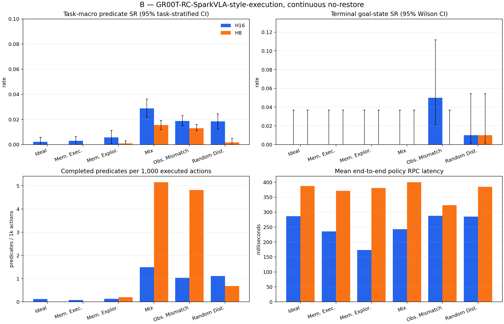

# B full RoboCerebra benchmark — reviewer report

## Scope and research question

B measures `GR00T-RC-SparkVLA-style-execution` with the frozen canonical hierarchy and a learned unified STOP/action-prefix selector with observation-conditioned prefix lengths and confirmed STOP advancement, but without goal predicates at inference, re-planning, retry, or recovery. The benchmark covers static, memory, partial-observation, disturbance, and mixed conditions on one continuous simulator timeline.

The official [RoboCerebra paper](https://arxiv.org/html/2506.06677v2) defines 60 tasks and 10 rollouts per task, and reports predicate/subtask success as its SR. This report additionally retains terminal goal-state success, ordered-goal reach, confidence intervals, action efficiency, post-reach stability, latency, and per-episode artifacts. The statistical reporting follows the artifact-level caution recommended by the [2026 manipulation benchmark audit](https://arxiv.org/html/2606.04233).

B is a GR00T-RC adaptation of the unified STOP/action-prefix selector specified by [SparkVLA](https://arxiv.org/abs/2608.16172v1). The pinned SparkVLA repository supplied no code or checkpoint, and the local successful-demonstration corpus supplied no authoritative failed-rollout labels; results are therefore not presented as an official SparkVLA reproduction.

## Benchmark coverage

| Condition | Capability stressed | B continuous-track realization |
| --- | --- | --- |
| Ideal | Static, fully observable long-horizon execution | Official Ideal task and initial state |
| Memory_Exploration | Active exploration to build an internal representation | Official exploration task, description, goals, scene, and initial state |
| Memory_Execution | Retrieval of previously relevant state for goal completion | Official memory-execution task, description, goals, scene, and initial state |
| Observation_Mismatching | Plan/perception misalignment | Official Ideal scene shifted to the second annotated demonstration state; already-forced predicates excluded |
| Random_Disturbance | Unexpected environment changes | Seeded 0.15 m object-y displacements during one uninterrupted rollout |
| Mix | Memory plus dynamic change and partial observation | Official Mix scene with shifted start and the same seeded displacement rule |

The low-level policy sees the active canonical subgoal plus live agent/wrist RGB and proprioception. B's planner is outcome-blind and supplies no symbolic memory, failure detector, retry, or state restoration.

## Headline results

| Run | Episodes | Task-macro SR (paper Eq. 1) | Pooled predicate SR | Terminal goal-state SR | Mean steps | Calls | Mean policy RPC |
| --- | ---: | ---: | ---: | ---: | ---: | ---: | ---: |
| H16 | 600 | 1.28% [1.08%, 1.49%] | 1.45% [1.25%, 1.68%] | 1.00% [0.46%, 2.16%] | 258.76 | 35.79 | 239.74 ms |
| H8 | 600 | 0.52% [0.43%, 0.62%] | 0.61% [0.52%, 0.73%] | 0.17% [0.03%, 0.94%] | 32.89 | 23.23 | 376.10 ms |

## Published RoboCerebra context

These Table 3 averages use the paper's benchmark-compatible resume/anchor protocol and are context only; they are not directly rank-comparable with this report's continuous no-restore B track.

| Published system | Average SR |
| --- | ---: |
| OpenVLA-Libero100 | 2.00% |
| OpenVLA* | 4.57% |
| Planner + OpenVLA* | 16.04% |
| Hierarchical Framework (HPE) | 16.55% |

## Results by condition

### H16

| Condition | Task-macro SR | Pooled SR | Terminal-state SR | Ordered-goal reached SR | Steps | Injections |
| --- | ---: | ---: | ---: | ---: | ---: | ---: |
| Ideal | 0.22% [0.00%, 0.58%] | 0.26% [0.00%, 0.66%] | 0.00% [0.00%, 3.70%] | 0.00% [0.00%, 3.70%] | 168.57 | 0 |
| Memory_Execution | 0.31% [0.00%, 0.64%] | 0.29% [0.00%, 0.58%] | 0.00% [0.00%, 3.70%] | 0.00% [0.00%, 3.70%] | 369.76 | 0 |
| Memory_Exploration | 0.57% [0.10%, 1.13%] | 0.50% [0.08%, 1.01%] | 0.00% [0.00%, 3.70%] | 0.00% [0.00%, 3.70%] | 470.52 | 0 |
| Mix | 2.87% [2.19%, 3.62%] | 3.23% [2.60%, 3.96%] | 0.00% [0.00%, 3.70%] | 0.00% [0.00%, 3.70%] | 208.25 | 96 |
| Observation_Mismatching | 1.88% [1.51%, 2.31%] | 2.58% [2.12%, 3.18%] | 5.00% [2.15%, 11.18%] | 0.00% [0.00%, 3.70%] | 164.60 | 0 |
| Random_Disturbance | 1.84% [1.23%, 2.45%] | 2.50% [1.71%, 3.29%] | 1.00% [0.18%, 5.45%] | 0.00% [0.00%, 3.70%] | 170.87 | 72 |

### H8

| Condition | Task-macro SR | Pooled SR | Terminal-state SR | Ordered-goal reached SR | Steps | Injections |
| --- | ---: | ---: | ---: | ---: | ---: | ---: |
| Ideal | 0.00% [0.00%, 0.00%] | 0.00% [0.00%, 0.00%] | 0.00% [0.00%, 3.70%] | 0.00% [0.00%, 3.70%] | 12.06 | 0 |
| Memory_Execution | 0.00% [0.00%, 0.00%] | 0.00% [0.00%, 0.00%] | 0.00% [0.00%, 3.70%] | 0.00% [0.00%, 3.70%] | 59.17 | 0 |
| Memory_Exploration | 0.10% [0.00%, 0.30%] | 0.08% [0.00%, 0.25%] | 0.00% [0.00%, 3.70%] | 0.00% [0.00%, 3.70%] | 49.68 | 0 |
| Mix | 1.55% [1.21%, 1.92%] | 1.98% [1.56%, 2.40%] | 0.00% [0.00%, 3.70%] | 0.00% [0.00%, 3.70%] | 36.81 | 4 |
| Observation_Mismatching | 1.31% [1.11%, 1.61%] | 1.82% [1.52%, 2.27%] | 0.00% [0.00%, 3.70%] | 0.00% [0.00%, 3.70%] | 24.89 | 0 |
| Random_Disturbance | 0.17% [0.00%, 0.50%] | 0.13% [0.00%, 0.39%] | 1.00% [0.18%, 5.45%] | 0.00% [0.00%, 3.70%] | 14.72 | 6 |

## Fixed-horizon ablation

Delta convention: H16 minus H8.

- Paper SR delta: 0.76% [0.54%, 0.98%]
- Pooled predicate SR delta: 0.84% [0.61%, 1.08%]
- Terminal goal-state SR delta: 0.83% [0.17%, 1.50%]
- Mean executed-step delta: 225.87 [201.49, 250.46]
- Partial-completion wins/ties/losses: {'wins': 41, 'ties': 553, 'losses': 6}

## Paired B ablation against A2

B is paired against `A2` / `GR00T-RC-fixed-hierarchy` by identical task, case, trial, initial-state seed, and execution horizon. Policy diffusion noise is not paired because concurrent clients share one server RNG stream.

| Run | Paper SR delta | Pooled SR delta | Terminal SR delta | Step delta | Wins/ties/losses |
| --- | ---: | ---: | ---: | ---: | ---: |
| H16 | -1.52% [-1.94%, -1.10%] | -1.47% [-1.90%, -1.06%] | -1.17% [-2.00%, -0.33%] | -1148.74 | {'wins': 18, 'ties': 504, 'losses': 78} |
| H8 | -2.13% [-2.51%, -1.77%] | -2.14% [-2.50%, -1.81%] | -2.00% [-2.50%, -1.50%] | -1374.61 | {'wins': 3, 'ties': 506, 'losses': 91} |

## Metric applicability

- RoboCerebra task-macro SR: the primary paper-style value, computed from Eq. (1) per task/rollout and averaged with equal weight across the 60 task instances.
- Reference-evaluator pooled SR: all completed state transitions divided by all possible transitions, matching the public evaluator's aggregate logger. It is reported separately because unequal task lengths make it differ from task-macro SR.
- Terminal goal-state SR (machine-readable legacy key `strict_full_task_success_rate`): every object's terminal goal predicate must hold in the final frame. It can be true even when the ordered evaluator never observed the full transition sequence.
- Ordered-goal reached SR: the public evaluator's sequential `_check_success` became true at least once. Stability/reactivation metrics are conditioned only on these reached episodes.
- Plan Match Accuracy: 100% by construction because B consumes the benchmark's canonical annotated plan; this is a structural contract check, not a learned-planner result. Plan Efficiency is reported per run as paper SR divided by mean declared plan length.
- VideoQA Action Completion Accuracy: N/A because B has no reflection/VideoQA head.
- Failure-detection precision/recall/latency and recovery success: N/A because B intentionally has neither detector nor recovery policy. Injection exposure and conditional outcomes remain in the raw episodes/traces.

## Reproducibility and limitations

Every run fixes model, dataset, and evaluator revisions; seed, task, trial, initial state, action conversion, 20 Hz control, full model input tensors, predicted chunks, executed transitions, and simulator state are retained. Policy/evaluator semantics and H8/H16 were frozen before inspecting full-test outcomes; only resumability, hardware sharding, integrity checks, and reporting were changed during execution. Confidence intervals quantify rollout uncertainty but do not establish real-world transfer. B derives diffusion noise independently for every request from episode seed and decision index, making it invariant to concurrent shard interleaving and pairing corresponding decision indices across H8/H16. This continuous no-restore protocol is intentionally stricter than RoboCerebra's anchor/resume mechanism, so the paper table is contextual rather than a direct leaderboard comparison.

See `metrics.json`, the condition/case CSV files, `environment.json`, and `artifact_inventory.json` for machine-readable evidence. The environment file hashes the exact B implementation sources; the inventory hashes every core JSON/JSONL file and the complete frame tree.
